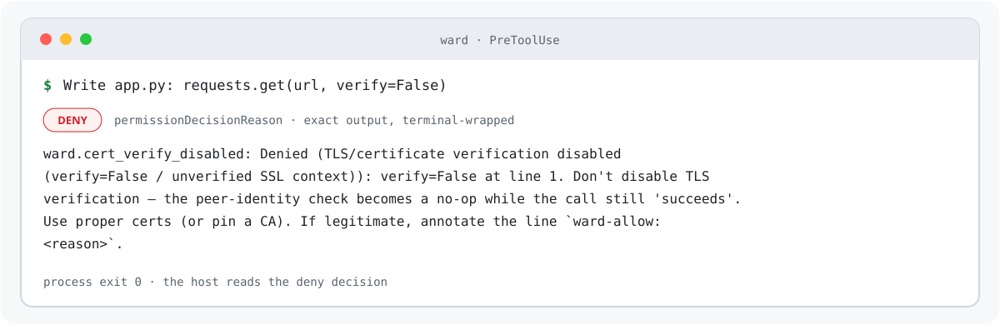
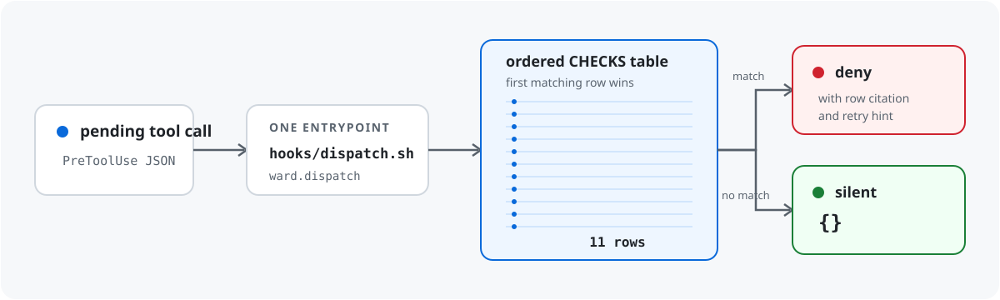

# Ward


**Nothing outright bad happens.** Ward is a Claude Code `PreToolUse` plugin: an ordered 11-row
table of exact denials over the pending tool call. A match denies with a citation and a retry
hint; anything else is a silent `{}`. No state, no history, no configuration.

## Install

Ward requires Python 3.11 or newer and has no Python package dependencies. From a local checkout:

```console
$ claude plugin marketplace add /path/to/ward
$ claude plugin install ward@ward --scope user
```

The marketplace entry in [.claude-plugin/marketplace.json](.claude-plugin/marketplace.json) exposes
the plugin metadata in [.claude-plugin/plugin.json](.claude-plugin/plugin.json). Enabling it loads
[hooks/hooks.json](hooks/hooks.json), which sends every `PreToolUse` event through the single
[hooks/dispatch.sh](hooks/dispatch.sh) entrypoint. The shim pins execution to the plugin root and
runs `python3 -m ward.dispatch`; there is no separate package-install step for the hook.



To exercise that same bridge without modifying a file:

```console
$ printf '%s' '{"hook_event_name":"PreToolUse","tool_name":"Write","tool_input":{"file_path":"/etc/ward-smoke","content":"x"},"cwd":"/tmp"}' | CLAUDE_PLUGIN_ROOT="$PWD" hooks/dispatch.sh
```

The response contains `permissionDecision: "deny"`. The shell exits normally with status 0: a
denial is a hook decision for the host to consume, not a process fault.

## What Ward denies

The ordered `CHECKS` table in [ward/checks.py](ward/checks.py) contains these 11 rows. The first
matching row wins.

| Row | Denies |
|---|---|
| `ward.forbidden_location` | Write, Edit, MultiEdit, or NotebookEdit path text that falls outside `cwd` under the row's lexical policy, enters a protected system or credential location, or names a shell startup or credential file. |
| `ward.timing_unsafe_compare` | Introduced Python `==` or `!=` comparisons involving a `.digest()`/`.hexdigest()` call or an identifier matching Ward's HMAC/hexdigest/signature/CSRF/OTP/passphrase/nonce grammar, apart from direct sentinel comparisons. |
| `ward.jwt_none_alg` | A jwt/jose/pyjwt `decode` call whose literal `algorithms` collection contains `"none"`. |
| `ward.jwt_signature_disabled` | A jwt/jose/pyjwt `decode` call with literal `verify=False` or literal `verify_signature=False` options. |
| `ward.cert_verify_disabled` | A `._create_unverified_context` attribute, assignment of literal `False` to `.check_hostname`, or literal `verify=False`/`check_hostname=False` on a recognized TLS-related call. |
| `ward.cert_reqs_none` | A recognized TLS-related call with `cert_reqs` set to bare or qualified `CERT_NONE`. |
| `ward.cert_none_mode` | Assignment of bare or qualified `CERT_NONE` to a `.verify_mode` attribute. |
| `ward.paramiko_host_key_weakened` | A `set_missing_host_key_policy` call with a literal `AutoAddPolicy` or `WarningPolicy` policy name. |
| `ward.outbound_secret_pattern` | An MCP, WebFetch, or WebSearch payload matching one of five exact raw grammars: GitHub personal access token, GitHub fine-grained token, private-key header, AWS access-key ID, or Anthropic API key. |
| `ward.self_mute_guard` | A supported source, configuration, or shell-file mutation that explicitly disables a verifier/check or removes its callable shape from a replacement. |
| `ward.integrity_suppression_flag` | A supported source, configuration, or shell-file mutation that introduces an audit/verification/integrity/attestation/checksum/signature/tamper/provenance suppression flag or environment-variable gate. |

The seven rows from `ward.timing_unsafe_compare` through
`ward.paramiko_host_key_weakened` parse only newly introduced Python in a `.py` mutation. The other
four use path text, serialized outbound payloads, or introduced-versus-removed mutation text.

## How dispatch works



[ward/dispatch.py](ward/dispatch.py) reads one JSON event. For a `PreToolUse` event, it applies the
mutation-input preflight where relevant, then evaluates the rows in order and emits one of two
protocol shapes:

- A match becomes `permissionDecision: "deny"` with the `ward.*` row identifier, the specific
  reason, and its retry hint.
- No match becomes `{}` — no opinion and no output-side rewrite.

Before the 11 rows, a separate `ward.cannot_evaluate` preflight denies a file mutation whose
required path or introduced text is missing, empty, independently unparseable Python, or an
ambiguous detached security keyword. Malformed input or a shim that cannot start also produces a
fail-closed denial, as does an internal dispatcher error while a `PreToolUse` check is due to run.
These are wiring/input failures, not extra rows in the `CHECKS` table.

## Allow an intentional match

The seven introduced-Python rows accept a narrow, auditable escape hatch: put a tokenized Python
comment containing `ward-allow: <reason>` on the same source line as the matched AST node.

```python
requests.get(url, verify=False)  # ward-allow: local fixture exercises an unverified endpoint
```

A bare `ward-allow`, a string or docstring mention, or a comment on another line does not exempt the
match. One annotated line does not exempt another. The path, outbound-secret, self-mute, integrity-
suppression, and cannot-evaluate denials do not honor this annotation.

## Scope, precisely

Ward is act-only. It evaluates the current pending `PreToolUse` event and keeps no state or history;
it does not judge statements, sequences, intent, or post-execution outcomes.

- Python inspection covers only introduced `.py` text: Write `content`, Edit `new_string`, and each
  MultiEdit `new_string` independently. NotebookEdit receives the path check, but its cell text is
  not parsed by the seven Python rows.
- The location row normalizes path text lexically. It does not resolve symlinks, inspect mounts, open
  the target, or provide filesystem confinement. Host-designated Claude plan storage is the row's
  sanctioned out-of-`cwd` case unless the path independently matches an earlier protected-location
  rule.
- The outbound row checks the serialized payload of MCP, WebFetch, and WebSearch calls against five
  raw credential grammars. It is not a general secret scanner and does not decode transformed
  values.
- `{}` means only that no exact predicate matched. It is not approval, a safety verdict, or proof
  about the later filesystem or network operation.

The full boundary and one named reachable bypass for every row are documented in
[SECURITY.md](SECURITY.md).

## Siblings

Ward is one of three engines that split one taxonomy — act, sequence, statement — and share
nothing else. Each installs alone; none inherits or implies the others' coverage.

| Engine | Judges | One line |
|---|---|---|
| **Ward** (this repo) | the pending **act** | nothing outright bad happens |
| [**Gyroscope**](https://github.com/Clear-Sights/Gyroscope) | the **sequence** | a session neither capsizes nor gets lost |
| [**Makoto**](https://github.com/Clear-Sights/makoto) | the **statement** | words aren't empty |

## Development

Run the standard-library suite from the repository root:

```console
$ python3 -m unittest discover -s tests
...
Ran 81 tests in <elapsed>s

OK
```

The shipped suite contains 81 tests. Keep new predicates narrow, add both firing and clean cases,
and exercise the shell entrypoint when changing hook wiring.

## Security and license

Ward's security boundary and named non-claims are documented in [SECURITY.md](SECURITY.md). Ward is
licensed under [Apache License 2.0](LICENSE); attribution and porting notes are in [NOTICE](NOTICE).

The README structure and local house-style influences are recorded in
[docs/README-PRIOR-ART.md](docs/README-PRIOR-ART.md).
